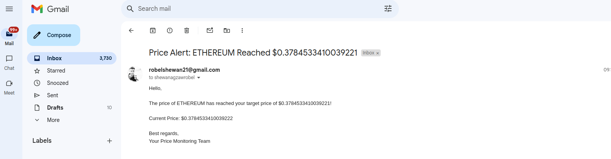
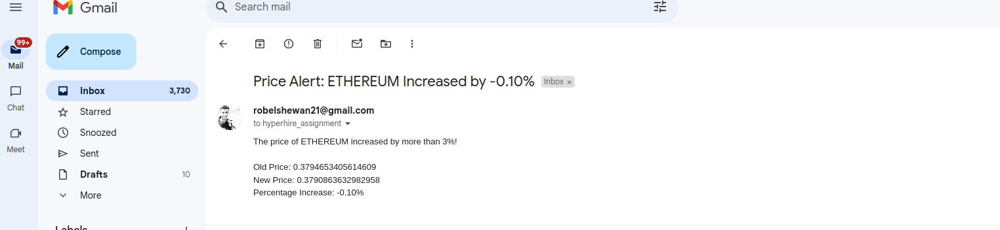

# Blockchain Price Tracker

A NestJS-based application that monitors the prices of Ethereum and Polygon, sends email alerts on significant price changes, and provides APIs for retrieving price data and setting custom alerts.

## Table of Contents

- [Features](#features)
- [Technical Stack](#technical-stack)
- [Setup](#setup)
  - [Prerequisites](#prerequisites)
  - [Installation](#installation)
  - [Environment Variables](#environment-variables)
- [Usage](#usage)
  - [API Endpoints](#api-endpoints)
    - [Get Hourly Prices](#get-hourly-prices)
    - [Set Price Alert](#set-price-alert)
- [Important Notes](#important-notes)
- [Troubleshooting](#troubleshooting)
- [License](#license)

## Features

1. **Automated Price Tracking**

   - Automatically saves the price of Ethereum and Polygon every 5 minutes.

2. **Email Notifications**

   - Sends an email to `hyperhire_assignment@hyperhire.in` if the price of a chain increases by more than 3% compared to its price one hour ago.

3. **Price Data API**

   - Provides an API to return prices for each hour within the last 24 hours.
   - **Parameters:**
     - `chain`: `"ethereum"` or `"polygon"`
   - **Description:**
     - Retrieves the latest prices for specific hours, allowing you to view price changes throughout the last 24 hours.

4. **Custom Price Alerts**
   - Allows users to set alerts for specific prices via an API.
   - **Example Request:**
     ```json
     {
       "email": "your_email@example.com",
       "chain": "ethereum",
       "targetPrice": "1000"
     }
     ```
   - **Note:**
     - Use `"chain": "ethereum"` or `"chain": "polygon"` when querying or creating alerts.

## Technical Stack

- **Framework:** NestJS
- **Database:** PostgreSQL with TypeORM
- **API:** Moralis for retrieving token prices
- **Containerization:** Docker and Docker Compose

## Setup

### Prerequisites

- [Node.js](https://nodejs.org/) (v14 or later)
- [Docker](https://www.docker.com/) & [Docker Compose](https://docs.docker.com/compose/)
- [PostgreSQL](https://www.postgresql.org/) database
- Moralis API Key

### Installation

1. **Clone the Repository**

   ```bash
   git clone https://github.com/Robel-shewan/blockchain-price-tracker.git
   cd blockchain-price-tracker

   ```

2. **Create Environment Variables**

   - Duplicate the `.env-example` file and rename it to `.env`.
   - Fill in the necessary environment variables as described below.

3. **Docker Setup**
   - Ensure Docker and Docker Compose are installed.
   - Build and run the containers:
     ```bash
     docker-compose up --build
     ```

## Environment Variables

Ensure your `.env` file includes the following variables:

```env
# Moralis API
MORALIS_API_KEY=your_moralis_api_key

# Token Addresses
MATIC_ERC20_ETHEREUM=0x7d1afa7b718fb893db30a3abc0cfc608aacfebb0

# Chain IDs (Hexadecimal)
ETHEREUM_CHAIN_ID=0x1
POLYGON_CHAIN_ID=0x89

# Email Configuration
EMAIL_HOST=your_email_host
EMAIL_PORT=your_email_port
EMAIL_USER=your_email_username
EMAIL_PASS=your_email_password
PERCENTAGE_EMAIL_SEND_TO=hyperhire_assignment@hyperhire.in

# Database Configuration
DB_HOST=your_db_host
DB_PORT=your_db_port
DB_USERNAME=your_db_username
DB_PASSWORD=your_db_password
DB_NAME=your_db_name
```

**Note:**

- Replace placeholders like `your_moralis_api_key`, `your_email_host`, etc., with your actual credentials.
- Ensure that `MATIC_ERC20_ETHEREUM` has a valid token address with liquidity pools.

## Usage

### API Endpoints

#### Get Hourly Prices

- **Endpoint:** `/api/prices`
- **Method:** `GET`
- **Parameters:**
  - `chain` (required): `"ethereum"` or `"polygon"`
- **Description:** Retrieves the latest prices for each hour within the last 24 hours.

- **Example Request:**
  ```bash
  GET /api/prices?chain=ethereum
  ```

### Swagger API Documentation

To access the automatically generated Swagger API documentation:

1. Run the application.
2. Open your browser and navigate to `http://localhost:3000/api`.

You will find interactive API documentation where you can test all available endpoints directly from the browser.

## Important Notes

- **Moralis API Key:** Use your own Moralis API key and add your Ethereum and Polygon token addresses.
- **Token Address Validation:**

  - Ensure the token address is correct and has liquidity pools.
  - **Example:**
    ```env
    MATIC_ERC20_ETHEREUM=0x7d1afa7b718fb893db30a3abc0cfc608aacfebb0
    ```
  - **Error Handling:** If you encounter `Not Found (404): No liquidity pools found for the specified token address`, verify the token address.

- **Chain IDs:**
  - Use the following hexadecimal chain IDs in Moralis:
    ```env
    ETHEREUM_CHAIN_ID=0x1
    POLYGON_CHAIN_ID=0x89
    ```
- **API Rate Limiting:**
  - Avoid making requests to the Moralis API too frequently (less than a few minutes apart) to prevent being blocked.

## Email Notifications

The application sends email notifications when certain conditions are met, such as a price alert or a percentage price increase of more than 3%.

The `isTrigger` flag prevents duplicate emails for the same alert.

### Example Email Notifications:

Here are two example screenshots of the email notifications:


_Email showing price alert notification._


_Email showing percentage price increase notification._

You can test the percentage increase alerts by simulating price increases. The environment variable `PERCENTAGE_EMAIL_SEND_TO` is set to `hyperhire_assignment@hyperhire.in` for percentage alert notifications.

- **Data Availability:**
  - If you receive the message `No price found for ${chain} from 1 hour ago`, it may be due to insufficient data.
  - To resolve this for testing purposes, you can:
  -     it for 1 hour to gather sufficient data.
        Seed some data from the previous hour.
        Temporarily comment out the check in the function that compares prices from one hour ago, as the requirement states it compares prices from one hour prior.
        This ensures the correct comparison logic for price changes over time but allows flexibility for testing scenarios.
    - **Solutions:**
      - Seed the data first.
      - Temporarily comment out the relevant check for immediate testing.

## Troubleshooting

- **No Liquidity Pools Found (404 Error):**
  - Ensure the token address is correct and has active liquidity pools.
- **Email Not Sending:**

  - Verify email configuration in the `.env` file.
  - Check spam or junk folders.

- **API Not Responding:**

  - Ensure Docker containers are running.
  - Check logs for any errors:
    ```bash
    docker-compose logs
    ```

- **Database Connection Issues:**
  - Verify database credentials and that the PostgreSQL service is running.

Let me know if you need more information, and if you encounter any issues while testing the application, please feel free to reach out.

```

```
